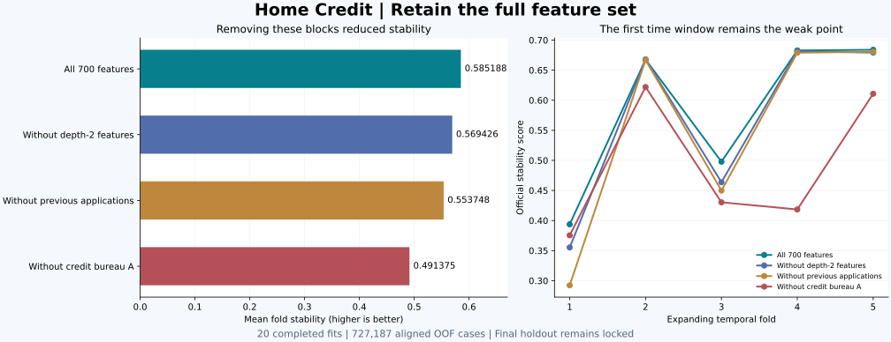
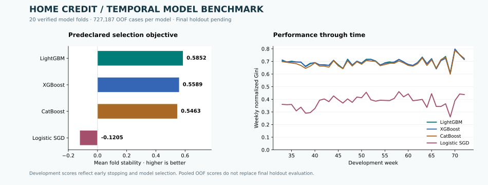

# Home Credit Model Stability

Research-grade credit-risk modeling under temporal distribution shift, built as a reproducible AWS SageMaker portfolio project.

## Latest result and next run

The feature ablation completed on September 7: **all 20 fits succeeded** and all
tested feature removals reduced stability. Keep the full **700-feature** model.
Read the [ablation evidence and executed notebook](reports/feature_ablation/README.md).



The next implemented stage is [bounded Optuna tuning](docs/model_tuning.md): eight
new LightGBM candidates x five temporal folds, reusing the accepted control. It has
UTC progress/heartbeats, a persistent S3 trial ledger, model-fold recovery, duplicate
writer protection and reports after each trial. Full-data tuning results are pending.

```bash
bash scripts/start_model_tuning.sh --bucket YOUR_ARTIFACT_BUCKET
```

The launcher runs quality gates and a separate smoke trial first. See the runbook for
the background-launch command, recovery behavior, expected runtime and the path to
final holdout evaluation, Kaggle inference/submission artifacts and a Hugging Face demo.

## Start with the executed review

Open [05_benchmark_review.ipynb](notebooks/05_benchmark_review.ipynb) directly on GitHub
for the research question, official metric, model comparison, fold score decomposition,
weekly population support, calibration, drift limits, and next experiments. Executed
static figures and tables are included; no AWS account or dataset is needed to read it.

## Current benchmark



The September 6 development benchmark completed **20 model folds** across four model
families. Independent acceptance verified **70 artifacts**, recomputed all fold, pooled,
and weekly metrics, and confirmed aligned out-of-fold predictions for **727,187 cases**.

| Model | Mean fold stability | Worst fold stability | OOF ROC AUC | OOF AP | OOF Brier | OOF log loss |
|---|---:|---:|---:|---:|---:|---:|
| LightGBM | 0.585188 | 0.393682 | 0.846894 | 0.204525 | 0.032425 | 0.126805 |
| XGBoost | 0.558892 | 0.343432 | 0.846576 | 0.204701 | 0.032441 | 0.126887 |
| CatBoost | 0.546330 | 0.297149 | 0.842745 | 0.201164 | 0.032512 | 0.127740 |
| Logistic SGD | -0.120990 | -0.587616 | 0.675620 | 0.102616 | 0.036354 | 0.253834 |

These numbers use **unclipped prediction ranks** for the official Gini stability
formula, ROC AUC, and AP; raw probabilities for Brier; and clipping to `[1e-7, 1-1e-7]`
only for log loss. The [metric audit](reports/benchmark/metrics.json) was recomputed
from SHA-256-verified saved predictions. The original
[acceptance record](reports/benchmark/acceptance.json) preserves its historical clipping
policy, which slightly changes the logistic baseline's ranking metrics. Boosting stability
scores and their ordering are unchanged.

**LightGBM is the development leader.** Selection uses mean fold stability, not pooled
OOF stability. Development folds inform early stopping and selection. Final holdout
evaluation on weeks 73-91 remains pending; these are not final-test or production claims.
The boosting models use 700 screened features. The logistic SGD baseline uses the
first 256 screened features with training-only imputation and standardization; this
is a lightweight sanity baseline, not an optimized linear-model comparison.

See the [benchmark evidence](reports/benchmark/README.md),
[machine-readable acceptance](reports/benchmark/acceptance.json), and
[interactive report](reports/benchmark/report.html). Download the HTML and open it in
a browser; JavaScript is embedded and no server is required.

### Reproduce the review

```bash
bash scripts/start_here.sh --require-persistent-storage
uv run --locked python scripts/review_model_benchmark.py
```

The review uses the committed, hash-pinned aggregate evidence. Add
`--benchmark-dir artifacts/benchmark_acceptance` to recompute metrics from the saved
OOF predictions. `--force` reexecutes all notebook cells. UTC logs in `logs/` include
per-cell progress, heartbeats, stage durations, and total runtime. Successful notebooks
are reused only when source, dependency lock, inputs, and output hashes still match.
A failed execution preserves the previous successful notebook and receipt. An interrupted
notebook restarts its inexpensive cells; no model training or download is invoked.

Report HTML IDs and SVG metadata are deterministic, so regenerating the same report
under the locked environment does not produce spurious Git changes.

### Reproduce acceptance of the completed run

```bash
bash scripts/start_here.sh --require-persistent-storage \
  --accept-benchmark --bucket YOUR_ARTIFACT_BUCKET
```

The command prepares the persistent environment and runs the quality gates before
restoring the pinned S3 publication into `artifacts/benchmark_acceptance`, checking
SHA-256 identities, recomputing metrics, and writing `reports/benchmark/`. Bootstrap
fits tiny synthetic smoke-test models; no benchmark model is retrained and no AWS
compute resource is created. Startup requires 12 GiB free for installation and reserve;
the acceptance bundle itself requires approximately 310 MB including its reserve. Repeated
runs reuse verified downloads. UTC console/JSONL logs include stage timings, a 15-second
heartbeat, per-fold progress, failures, and total elapsed time.
Supply the existing bucket locally with `--bucket`, or set `HOME_CREDIT_ARTIFACT_BUCKET`.
The acceptance policy contains no AWS account ID or account-specific bucket address.

To keep startup running after disconnecting the terminal, use this launch command
from the repository root (replace `YOUR_ARTIFACT_BUCKET`):

```bash
bash <<'BASH'
set -euo pipefail
mkdir -p logs
CONSOLE_LOG="logs/startup-$(date -u +%Y%m%dT%H%M%SZ)-$$.log"
touch "$CONSOLE_LOG"
nohup bash scripts/start_here.sh \
  --require-persistent-storage \
  --accept-benchmark --bucket YOUR_ARTIFACT_BUCKET \
  --heartbeat-seconds 15 \
  >> "$CONSOLE_LOG" 2>&1 < /dev/null &
STARTUP_PID=$!
printf 'Startup PID: %s\nLog: %s\n' "$STARTUP_PID" "$CONSOLE_LOG"
printf 'Ctrl+C stops the viewer; startup continues.\n'
tail --pid="$STARTUP_PID" -n 30 -F "$CONSOLE_LOG"
wait "$STARTUP_PID"
BASH
```

The log exists before the worker and viewer start. The final `wait` preserves the
worker's exit status. A terminal disconnect leaves the worker running; a SageMaker
app stop ends it. Rerunning the command reuses the persistent environment and
SHA-256-verified downloads, then reruns validation. Completion prints
`PHASE_5A_ACCEPTANCE_COMPLETED` followed by the `start_here_completed` event.

For an already restored bundle, invoke `scripts/accept_model_benchmark.py` directly
with the prepared project Python, omit `--download`, and supply `--benchmark-dir PATH`.
The bundle must contain the pinned `checkpoint_manifest.json`. S3 restoration is
covered by injected-client tests; acceptance was also executed against all real artifacts.

The next modeling step is controlled LightGBM/XGBoost tuning and feature-block
ablation, preceded by investigation of weak folds and the screening adversarial AUC
of 0.998944. Keep the outer holdout locked until model and calibration choices are frozen.

## Engineering principles

- Python 3.12 with a project-local `uv` environment and committed `uv.lock`.
- CPU-first modeling with LightGBM, CatBoost, and the CPU-only XGBoost distribution.
- A separate GPU environment will be introduced later for the neural challenger; CUDA dependencies do not belong in the CPU foundation.
- Point-in-time-safe feature engineering and locked out-of-time validation.
- UTC structured logging, stage timings, total runtime, persistent JSONL logs, and heartbeats for long-running stages.
- Explicit unit and integration tests before expensive experiments.
- Canonical filenames only. Source history lives in Git, not `fix`, `repair`, `v2`, or `final` filenames.
- Immutable raw-data manifests and S3 provenance before modeling.

## Start here in SageMaker

From the extracted repository root:

```bash
bash scripts/start_here.sh
```

The entry point first performs a dependency-free source-integrity check. This catches missing internal modules, forbidden filenames, Python syntax errors, shell syntax errors, and required dependency mistakes **before** installing the ML environment.

If bootstrap succeeds:

```bash
bash scripts/connectivity_check.sh
```

Before any Kaggle download, the project enforces a local storage safety floor. The
competition download is blocked unless at least 30 GiB of persistent staging capacity is free by default. Override only deliberately with `MIN_STAGING_FREE_GIB=<value>` after verifying an alternate storage plan.

Kaggle is project-managed and invoked through the locked `uv` environment; it does not depend on a global `kaggle` executable.

## CPU foundation

The initial environment includes:

- NumPy / SciPy / pandas
- Polars / PyArrow
- scikit-learn
- LightGBM
- CatBoost
- XGBoost CPU
- Optuna
- SHAP
- boto3
- official Kaggle CLI
- Ruff / mypy / pytest / coverage / pre-commit

The model smoke gate fits and predicts with LightGBM, CatBoost, and XGBoost on deterministic synthetic data before any Home Credit training begins.

## Project sequence

1. Repository and environment integrity.
2. AWS/Kaggle/Git connectivity.
3. Git/GitHub baseline and CI.
4. Kaggle acquisition and immutable raw-data manifest.
5. S3 raw snapshot.
6. Data catalog and schema contracts.
7. Locked expanding-window validation protocol.
8. Point-in-time-safe feature system.
9. Logistic sanity baseline.
10. LightGBM benchmark.
11. CatBoost benchmark.
12. XGBoost benchmark.
13. Optuna optimization and feature/model ablations.
14. Separate neural challenger environment.
15. OOF ensemble, calibration, drift, robustness, SageMaker jobs, MLflow, and final portfolio reporting.

See `PROJECT_PLAN.md` for the detailed roadmap.


## External authentication

Kaggle credentials are intentionally not stored in this repository. Authenticate interactively
inside SageMaker with `uv run --locked kaggle auth login`, then rerun
`scripts/connectivity_check.sh`. Git author identity is also repository-local configuration rather
than project source; set `git config user.name` and `git config user.email` before the first commit.

Raw competition files are staged one at a time in `data/staging` and uploaded to the conventional
SageMaker S3 bucket (`sagemaker-<region>-<account-id>` by default). The ingestion script does not
require bucket-administration permissions. Every uploaded data object is explicitly encrypted with
SSE-S3 and carries its SHA-256 digest as object metadata for post-upload verification.

## SageMaker storage layout

Source, `.venv`, managed Python, dependency caches, local checkpoints, logs, and reports
live on the project volume. `.venv` is a real directory. Managed Python 3.12.14 and
caches live under `artifacts/runtime`; restored benchmark artifacts live under
`artifacts/benchmark_acceptance`. The completed model checkpoints also remain in S3.

`scripts/start_here.sh` is the canonical entry point. It logs the actual mounted
filesystem and free capacity before changing the environment. In SageMaker, supply
`--require-persistent-storage` to reject container overlay or memory-backed storage.
A configured 100 GiB space is not evidence of 100 GiB currently mounted or available.
There is no automatic fallback to `/tmp` when capacity is insufficient.

Historical `.venv` symlinks are detached only after the persistent interpreter is
available; their old targets are preserved. Healthy persistent environments and
verified downloads are reused. Partial environment creation is recoverable, and
installed packages are reconciled to the existing `uv.lock`. The bootstrap lock
prevents two startup processes from changing the environment simultaneously.
Startup, dependency installation, quality gates, and acceptance emit UTC events,
15-second outer heartbeats, stage times, total time, and durable text/JSONL logs.
After interruption, rerun the same command. Validation checks repeat; completed
model training and verified artifact downloads do not repeat.

EBS persistence covers stopping/restarting the application and changing instances;
it is not a backup against deleting the space. GitHub holds source history and S3
holds published experiment artifacts. Python environments are installed once on the
space volume; they are reproducible from pinned tools and the committed lockfile.

See [AWS storage behavior](https://docs.aws.amazon.com/sagemaker/latest/dg/studio-updated-jl-user-guide.html)
and [uv environment configuration](https://docs.astral.sh/uv/concepts/projects/config/#project-environment-path).

## Next experiment: controlled feature ablation

Phase 5B is complete. [Run the LightGBM feature-block ablation](docs/feature_ablation.md)
to compare a 700-feature control with three predeclared removals on the same five
temporal folds. The launcher runs quality gates and a capped smoke suite before
full training, saves each model-fold to S3, and creates an offline HTML report and
executed notebook. Weeks 73-91 remain locked. Ablation results are pending.
