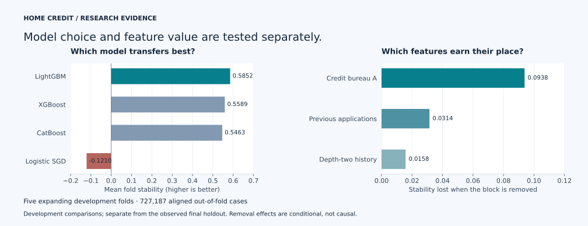

# Home Credit Model Stability

An evaluated credit-risk ML system built around one question: **does predictive
performance survive a move into future application periods?** The project combines
relational feature engineering, temporal model comparison, controlled ablations,
resumable AWS execution and a portable inference pipeline.

## Review in five minutes

1. [Feature engineering](notebooks/02_feature_engineering.ipynb): 2,508 candidates,
   training-only screening, 700 retained features and measured feature-family value.
2. [Model comparison](notebooks/05_benchmark_review.ipynb): four model families on
   five expanding temporal folds.
3. [Frozen future-period evaluation](notebooks/09_model_release.ipynb): the final
   result, reliability, native model lineage and tested inference boundaries.

For the full experimental trail, read the [feature ablations](reports/feature_ablation/06_feature_ablation.ipynb),
[tuning](notebooks/07_model_tuning.ipynb) and [ensemble selection](notebooks/08_model_selection.ipynb).
The later [feature study](notebooks/11_feature_research.ipynb) tests a wider budget,
256 engineered additions and 96 raw-history additions. It includes SHAP, grouped
permutation, redundancy diagnostics and an explicit event-date availability audit.
The [calibration study](notebooks/12_calibration.ipynb) tests whether probability
mappings transfer across development periods. Both retain unsuccessful comparisons.
The notebooks embed readable tables, interactive Plotly figures and static GitHub
fallbacks. Reading the evidence requires no cloud account or borrower-level data.
The [model card](MODEL_CARD.md) summarizes intended use, artifact distinctions and
the observed limits relevant to interpreting the results.
The [completion record](docs/completion.md) maps the finished work to its verification evidence.

For the current state and optional AWS monitoring, see [project status](docs/project_status.md).
**The bounded research portfolio is complete.** Its expanded feature gate is
closed with executed distribution comparisons, documented chronology exclusions
and a registered future promotion protocol. The protocol itself is not an
executed experiment. No cloud job needs to stay running to review these results.



This figure is rebuilt from the accepted aggregate reports. The left panel compares
model families; the right measures the stability lost after removing each feature
block. Both use the five development folds, separate from the final evaluation below.

## Final frozen evaluation

| Diagnostic | Reserved weeks 73-91 |
|---|---:|
| Official weekly Gini stability | **0.729674** |
| ROC AUC | **0.875759** |
| Average precision | **0.193755** |
| Raw Brier score | **0.019282** |
| Log loss | **0.080695** |
| Applications | **203,345** |

The evaluated model is a 90% tuned / 10% original LightGBM blend, trained on
**1,323,314 applications from weeks 0-72**. Before evaluation, the release froze
features, weights, no calibration, seeds and development-derived iteration budgets.
The immutable intent identifies the exact two models and encoders. No holdout early
stopping or model selection was permitted.

A **separate inference refit** used all **1,526,659 labeled applications**. The holdout
score above belongs to the development-trained models, not to that all-label refit.
It is a local temporal evaluation, not a Kaggle leaderboard score. Differences in
period length and population mean it should not be read as a gain over development
fold scores.

## What the experiments show

- **Features:** 2,508 candidates; 2,034 structurally eligible; 700 retained. Screening
  used weeks 0-32, before model-validation weeks 33-72. Stored statistics account for
  all 1,808 rejections, including 1,334 eligible features below the computation limit.
- **Ablations:** removing credit bureau A, previous applications or depth-two history
  reduced mean development stability by **0.093813**, **0.031440** and **0.015762**.
  These are controlled removal comparisons, not individual-feature causal effects.
- **Models:** LightGBM led XGBoost, CatBoost and a logistic SGD baseline across five
  expanding folds. The accepted benchmark contains 20 model-fold evaluations and
  aligned out-of-fold predictions for 727,187 cases.
- **Tuning:** eight LightGBM candidates across five folds completed 40 new fits.
  The selected trial improved mean stability from 0.585188 to 0.601238.
- **Blending:** 15 fixed candidates reused saved predictions. The selected blend
  reached 0.601899 mean development stability; its small gain of 0.000661 came with
  a weaker worst fold. It is not evidence of statistical significance.
- **Expanded feature research:** 4,617 additional hypotheses, 256 retained, 20 new
  comparison fits. The full extension improved pooled AUC but reduced mean stability
  by **0.025284**. Doubling the original budget to 1,400 gave a **0.001290** mean gain
  and a weaker worst fold. These post-release development results did not change the release.
- **Raw-history research:** 524 median, IQR, p90 and skew candidates; 96 retained;
  ten new comparison fits. The 796-feature condition reaches 0.584195 mean stability
  (-0.000994 vs the original control); removing its 13 skew features reaches
  0.588678 (+0.003490). Both improve the weakest fold but win on only three of five
  folds; their omission ranges cross zero. These modest, inconsistent development
  changes preserve the already-evaluated release.
- **Calibration:** eight past-fold sigmoid/isotonic fits evaluated 544,611 later
  development cases. Neither improved pooled Brier score or log loss. This four-fold
  comparison has a different population from the five-fold model-selection study.

The official metric is:

`mean weekly Gini + 88 * min(weekly slope, 0) - 0.5 * residual standard deviation`

Gini is `2 * ROC AUC - 1`. Probability metrics and reliability complement the
ranking metric. No calibrated production default-probability claim is made.

## Engineering and reproducibility

The feature engine builds 34 train/test blocks from 17 relational groups. Saved
artifacts bind raw-data, feature, validation, configuration, code and dependency
identities. Global frequency maps are learned only on the relevant fit population.

Expensive runs checkpoint to S3 with content hashes, conditional writer leases and
verified read-back. Valid completed fits and prediction batches are reused. UTC logs
include stage progress, stage/total elapsed time and heartbeats. Reviews do not
retrain models. Native model reloads reproduce the saved probabilities.

CI runs Ruff, strict mypy, tests with warnings treated as errors, real notebook
execution, output reproduction and unchanged-notebook reuse. Generated exports are
classified separately from authored Python and notebooks in GitHub language statistics.
Canonical filenames are edited in place.

```bash
bash scripts/start_here.sh --require-persistent-storage
uv run --locked python scripts/review_model_benchmark.py --force
uv run --locked python scripts/review_model_tuning.py --force
uv run --locked python scripts/review_model_selection.py --force
uv run --locked python scripts/review_model_release.py --force
uv run --locked python scripts/review_submission.py --force
uv run --locked python scripts/review_feature_research.py --force
uv run --locked python scripts/review_calibration.py --force
```

The dependency lock uses Python 3.12.14. The [operating contract](AGENTS.md),
[frozen release policy](configs/model_release.json) and
[release runbook](docs/model_release.md) describe the validation boundaries.
Do not rerun training merely to view results.

## Kaggle inference and submission

[Notebook 10](notebooks/10_submission.ipynb) runs the frozen all-label model on the
raw test files supplied by Kaggle. It discovers the attached model dataset, installs
21 hash-locked inference wheels in an isolated offline environment, and writes a
validated `submission.csv` with a lineage receipt. Outside Kaggle, CSV generation
is disabled by default. [Submission runbook](docs/kaggle_submission.md).

Kaggle saved notebook **version 1** completed offline and matched both verified AWS
exports byte for byte, with zero model fits. The ten public examples are an
integration fixture. The saved version has now been submitted; Kaggle reports
**Notebook Running (after deadline)** on the
[submissions page](https://www.kaggle.com/competitions/home-credit-credit-risk-model-stability/submissions).
Its hidden-test score is pending. The project's observed holdout metric remains
separate evidence.

## Research scope

This is an evaluated, bounded research portfolio release. The expanded study tests
ratios, dispersion, category interactions, recency, household comparisons,
missingness and training-only peer statistics, with all rejections accounted for.
The separate raw-history study computes within-applicant median, IQR, p90 and
skew directly from verified source shards. Across the original and two added
screens, 7,649 hypotheses are accounted for; the release still uses 700 features.
A finite search does not establish exhaustive discovery. Thirty-three resolved
date fields lack the field-level event/availability contract needed for verified
chronological lags and trends, so that avenue is explicitly excluded. Numeric
calendar parts are not proof of event ordering. Native categorical target
statistics were evaluated through CatBoost. Neural challengers and fully nested
promotion experiments were not performed.

The original holdout is now observed and bound to the frozen release. Further feature
or model exploration must use development data and be labeled accordingly; it cannot
reuse this holdout as a new untouched test. Production deployment, lending-policy
fairness validation and an operational monitoring service are outside the tested scope.
