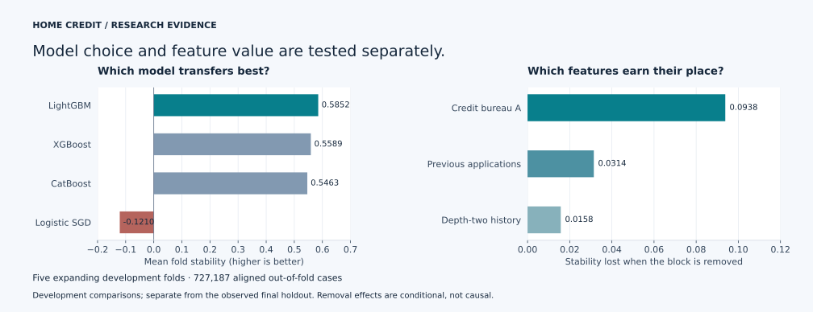

# Home Credit Model Stability

[](https://github.com/alvaromendizabal/home-credit-model-stability/actions/workflows/ci.yml)
[](https://github.com/alvaromendizabal/home-credit-model-stability/actions/workflows/public-demo.yml)

**I built a credit-risk research and inference system that evaluates performance across time and makes its evidence reproducible.**

A model can rank historical applicants well and still weaken in later periods. My work connects relational features, expanding-window evaluation, controlled experiments, resumable AWS execution and verified inference. The public review preserves both successful results and rejected ideas.

**[Explore the interactive demo](https://home-credit-stability-lab.tartmacaw2.chatgpt.site)** · [Five-minute review](docs/employer_review.md) · [Case study](docs/case_study.md) · [Model card](MODEL_CARD.md)

Built by [Alvaro Mendizabal](https://github.com/alvaromendizabal).

## Three engineering results

- **A documented feature pipeline at application scale:** **1,526,659 applications**, **17 relational source groups**, **2,508 initial feature candidates** and a **700-feature frozen release**. Training-only screening and explicit rejection accounting make the representation inspectable.
- **Temporal evaluation with meaningful controls:** **four model families × five expanding folds**, aligned on **727,187 out-of-fold cases**. Feature removals, tuning and later-period confirmation separate useful signal from complexity that does not transfer.
- **Verified inference and recoverable work:** native-model reload, raw-feature parity, exact case ordering, immutable manifests and S3 checkpoint recovery. A saved offline notebook reproduced the verified export on ten supplied examples with zero fits; that is an integration check, not population-wide equivalence.


## Measured results, separate populations

| Evidence | Result | Evaluation scope |
|---|---|---|
| Frozen release ranking and stability | **0.875759 ROC AUC · 0.729674 weekly-Gini stability** | 203,345 later-period applications; development-trained release |
| Same release probability diagnostics | **0.193755 average precision · 0.019282 Brier · 0.080695 log loss** | Same 203,345 applications |
| Original all-label inference refit | **0.56062 public · 0.47429 private** | Separate late Kaggle evaluation |
| Later tree + histogram + neural ensemble | **0.56035 public · 0.47652 private** | Separate post-release, all-label Kaggle evaluation |

**0.729674 is a local future-period stability score, not a Kaggle score.** Weeks 73–91 were opened only after the original release choices were frozen; they are now observed and cannot become a fresh test for later research. The all-label refits are different artifacts. These results do not establish production lending readiness.

[Release evidence](reports/model_release/evaluation.json) · [Original external receipt](reports/kaggle_submission/execution.json) · [Later external result](reports/post_release_frontier/october_2026.md) · [Evaluation limits](MODEL_CARD.md)

## Explore stability in the browser

The [interactive demo](https://home-credit-stability-lab.tartmacaw2.chatgpt.site) lets you change a synthetic weekly discrimination curve and inspect how decline and variability affect the score. Pin a baseline, change the candidate and inspect both on the same 24 weeks, with signed score-component differences and paired exports. Calculations run in the browser without an account or backend.

These are **synthetic weekly aggregates**, not applicant predictions, a trained model or a new research result. The [demo instructions](docs/public_reproducibility.md#interactive-demo) explain local launch and numerical checks. Actual experiment evidence is reviewed separately below.

## Reproduce a public result in one command

From a clone with **Python 3.12**:

```bash
python3 scripts/review_public_evidence.py --output artifacts/public-review
```

Open `artifacts/public-review/index.html`, or inspect its `review.json`. This standard-library command authenticates committed aggregate reports, recalculates weekly-Gini stability, checks comparison populations and reproduces model/ablation summaries. It needs no credentials, cloud account, private data or training job.

It does not reconstruct borrower predictions or recompute AUC from unavailable labels. Source-reported metrics and recomputed statistics are labeled separately. The checked-in [HTML report](reports/public_review/index.html) and [JSON result](reports/public_review/review.json) are reproduced in CI.

[Full reproducibility guide](docs/public_reproducibility.md) · [Executed benchmark](notebooks/05_benchmark_review.ipynb) · [Frozen release notebook](notebooks/09_model_release.ipynb)

## What the experiments taught me

**Feature families earned their place.** Removing credit bureau A, previous applications or depth-two history reduced mean development stability by **0.093813**, **0.031440** and **0.015762**. These are controlled predictive removal effects, not causal effects on borrowers. [Ablation evidence](reports/feature_ablation/README.md).

**More features could make the objective worse.** A 256-feature extension improved pooled AUC but reduced mean stability by **0.025284**. I retained the negative result and its selection receipts. [Feature study](notebooks/11_feature_research.ipynb).

**Selection gains needed later confirmation.** Several later model and representation studies improved earlier development periods and weakened on later confirmation. Those candidates were rejected. Repeatedly explored development folds remain development evidence. [Research record](docs/post_release_research.md).



Both panels use the five development folds. Their metrics are not directly comparable with the separate future-period release evaluation.

## Current research snapshot

The latest inspected **E98 execution completed five model fits**, but its selected candidate failed later-period confirmation and was rejected. It produced no new submission or external score. The historical release remains frozen; [current status](docs/project_status.md) records the decision and separate evidence scopes.

## Review the implementation

| Question | Entry point |
|---|---|
| How were features screened and joined? | [Feature notebook](notebooks/02_feature_engineering.ipynb), [feature code](src/home_credit/features) |
| How were models compared fairly? | [Benchmark](notebooks/05_benchmark_review.ipynb), [validation code](src/home_credit/validation) |
| How does interrupted work resume? | [Research engineering](docs/research_engineering.md), [runtime code](src/home_credit/runtime) |
| What do the quality gates execute? | [Locked review commands](docs/public_reproducibility.md#full-notebook-and-source-checks), [CI](.github/workflows/ci.yml) |

Published: historical research code, aggregate metrics, executed reviews, contracts and reproducibility checks. Private: borrower records, derived matrices, trained research artifacts, active feature identities, current ensemble specifications and operational bundles. Existing source credits and licenses remain in force. [Precise disclosure boundary](docs/public_reproducibility.md#disclosure-boundary).

No cloud workload needs to remain running to review this repository. Lending-policy impact, event-time availability and production fairness remain unvalidated.
