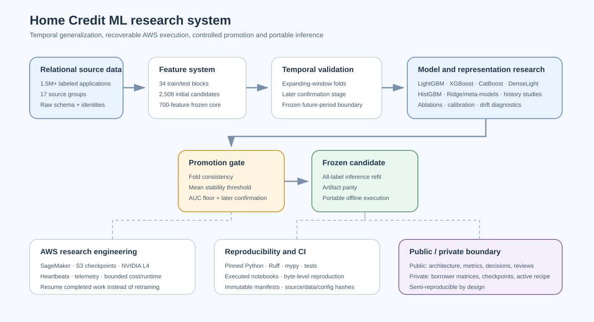

# Employer review guide

This repository is an end-to-end machine-learning research and engineering project for
temporal credit-risk modeling. It is intentionally structured so a reviewer can inspect
the important engineering and scientific evidence without access to borrower-level data,
private model checkpoints or the active competition recipe.

## 30-second summary

| Area | Evidence |
|---|---|
| Scale | 1,526,659 labeled applications; 17 relational source groups |
| Feature system | 2,508 initial candidates; 700-feature frozen core; controlled ablations and later research extensions |
| Validation | Expanding-window temporal model selection, later-period confirmation and a separately frozen future-period evaluation |
| Models | LightGBM, XGBoost, CatBoost, logistic SGD, DenseLight, HistGradientBoosting and heterogeneous meta-models |
| Cloud | AWS SageMaker, S3-backed checkpoints, NVIDIA L4 GPU research |
| Reliability | Hash-pinned artifacts, immutable manifests, resumable model folds, resource telemetry and fail-fast gates |
| Inference | Portable offline bundle, raw-feature parity checks and byte-level prediction reproduction |
| Research discipline | Negative results retained; selection-stage gains are rejected when they fail later-period confirmation |

The central engineering question is not merely whether a model scores well on pooled
historical data. It is whether model quality, ranking and reliability survive a move into
future application periods under measurable distribution shift.

## Architecture

The public repository exposes architecture, validation rules, aggregate metrics,
reproducibility contracts and lifecycle decisions. Private AWS artifacts retain exact
active feature identities, borrower-level matrices, model checkpoints and competition
runtime bundles. The [public reproducibility boundary](public_reproducibility.md)
documents that split explicitly.

## Recent frontier in one minute

The later research program has moved well beyond ordinary tree tuning. More than one
hundred bounded predictive or adapter fits have tested efficient neural ensembles,
learned historical representations, nonlinear numerical encodings, self-supervised
objectives, retrieval-based models, source-robust training and categorical-information
recovery.

The repeated finding is scientifically useful: several candidates look strong on
earlier periods and then weaken on later confirmation periods. The project therefore
treats **rejection quality** as an engineering outcome. A model is not promoted merely
because it improves an average development score.

For an employer, this frontier demonstrates:

- how to design expensive experiments with explicit promotion and kill gates;
- how to separate a new mechanism from a matched control;
- how to resume model-fold work without silently retraining completed stages;
- how to attribute failures to data, runtime, validation or modeling rather than
  collapsing them into one generic "experiment failed" state;
- how to publish enough evidence for serious review without releasing private data or
  the active competitive recipe.

## What to review by role

### Machine Learning Engineer

Start with:

1. [Research engineering and reproducibility](research_engineering.md)
2. [Model release runbook](model_release.md)
3. [Feature engineering notebook](../notebooks/02_feature_engineering.ipynb)
4. [Frozen model release notebook](../notebooks/09_model_release.ipynb)

Signals to look for:

- resumable AWS/SageMaker execution;
- S3 checkpoint identity and verified read-back;
- effective-device checks for GPU workloads;
- immutable run manifests and lineage;
- inference isolation and raw-feature parity;
- real notebook execution and CI-backed publication gates.

### Senior Data Scientist

Start with:

1. [Benchmark review](../notebooks/05_benchmark_review.ipynb)
2. [Feature ablation](../reports/feature_ablation/06_feature_ablation.ipynb)
3. [Expanded feature research](../notebooks/11_feature_research.ipynb)
4. [Post-release research](post_release_research.md)

Signals to look for:

- temporal cross-validation rather than random splits;
- feature-family ablations;
- calibration experiments;
- model-family comparisons;
- explicit promotion and kill thresholds;
- preservation of negative results and confirmation failures.

### Applied Scientist

Start with:

1. [Post-release frontier report](../reports/post_release_frontier/october_2026.md)
2. [Frontier continuation](../reports/post_release_frontier/october_2026_continuation.md)
3. [Model card](../MODEL_CARD.md)

Signals to look for:

- hypothesis-driven model and representation research;
- learned neural and heterogeneous ensembles;
- temporal-shift diagnostics;
- robustness versus ordinary AUC tradeoffs;
- controlled tests of categorical, sparse, historical and ranking representations.
- later controlled studies of self-supervision, retrieval, source robustness and categorical-information recovery.

## Selected engineering outcomes

### Temporal validation discipline

Development uses expanding temporal folds. Promising candidates must improve the
official weekly-Gini stability metric on earlier development windows and then survive
a separate later confirmation stage. Weeks already used for the historical frozen
evaluation are not recycled as a new untouched test.

This protocol repeatedly rejected models that looked strong on earlier periods but
did not transfer later. That is an intentional project outcome.

### Reproducibility and recovery

The research system records:

- source, configuration, dependency and data identities;
- immutable run IDs and parent/child resume lineage;
- completed and remaining model-fold work;
- checkpoint and prediction identities;
- CPU, RAM, GPU, GPU-memory and disk telemetry;
- explicit success, rejection, timeout and failure states.

A completed fold is reused after a downstream interruption rather than silently
retrained. Avoidable failures are turned into regression tests before the next
expensive run.

### Portable inference

The evaluated release has a separate all-label inference artifact with isolated,
hash-locked dependencies. Raw test features are rebuilt from supplied source files,
then validated for schema, case coverage, order and finite predictions.

Saved notebook execution reproduced verified AWS exports byte-for-byte before the
external evaluation path was used.

## Selected scientific outcomes

| Study | Result | Decision |
|---|---|---|
| Core feature selection | 2,508 candidates reduced to a 700-feature frozen core | Accepted |
| Model benchmark | LightGBM led XGBoost, CatBoost and logistic SGD on temporal development folds | Accepted benchmark |
| LightGBM tuning | Mean development stability improved from 0.585188 to 0.601238 | Accepted for development |
| Frozen blend | 0.729674 weekly-Gini stability and 0.875759 AUC on reserved weeks 73–91 | Frozen evaluated release |
| Previous-application histograms | Complementary signal improved the later heterogeneous research frontier | Retained as component |
| DenseLight | GPU neural challenger passed development confirmation and joined the later ensemble | Retained as component |
| Broad temporal / relational studies | Several large selection gains reversed on later confirmation | Rejected |
| Ridge meta-model | Strong selection gain failed later confirmation | Rejected |
| Chronological history representation | Small AUC gain accompanied a large stability loss | Rejected |
| GPU ranking objectives | Completed matched pointwise/global/within-week comparison; no promotable stream | Rejected |

The repository deliberately separates accepted evidence, rejected hypotheses and
registered future work. A negative result is not hidden or relabeled after the fact.

## Business and production interpretation

For an ML organization, the project demonstrates several transferable capabilities:

- designing evaluation around future-period generalization rather than random holdouts;
- detecting distribution shift before trusting a pooled metric;
- separating ranking quality from probability quality and temporal stability;
- controlling leakage across feature fitting, categorical statistics and calibration;
- using cloud checkpoints and immutable identities to make expensive experiments recoverable;
- preventing silent hardware/runtime changes from invalidating scientific comparisons;
- maintaining a public/private reproducibility boundary appropriate for proprietary or competitive work.

The repository does **not** claim production lending readiness. Fairness validation,
policy thresholds, event-time certification, outcome-maturity controls and operational
monitoring would require separate production governance.

## Reproducibility boundary

Public Git is intentionally sufficient to review the system and reproduce the
published review layer without exposing the private research recipe.

Public:

- validation design;
- aggregate fold metrics and decisions;
- model-family descriptions;
- review notebooks and figures;
- reproducibility and CI contracts;
- release/inference verification logic.

Private:

- borrower-level matrices;
- exact active frontier feature identities;
- trained frontier checkpoints;
- private experiment bundles;
- active competition runtime recipes.

This boundary is part of the project design, not missing documentation.
